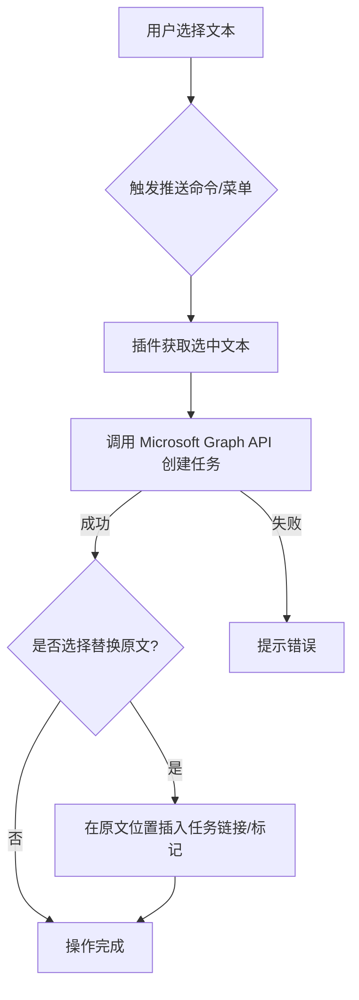
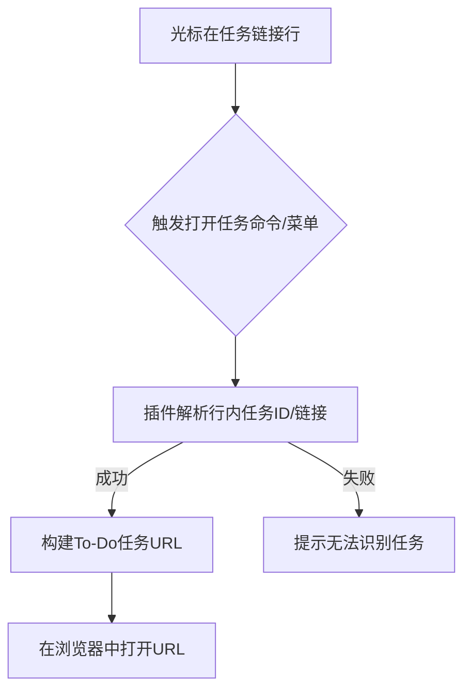
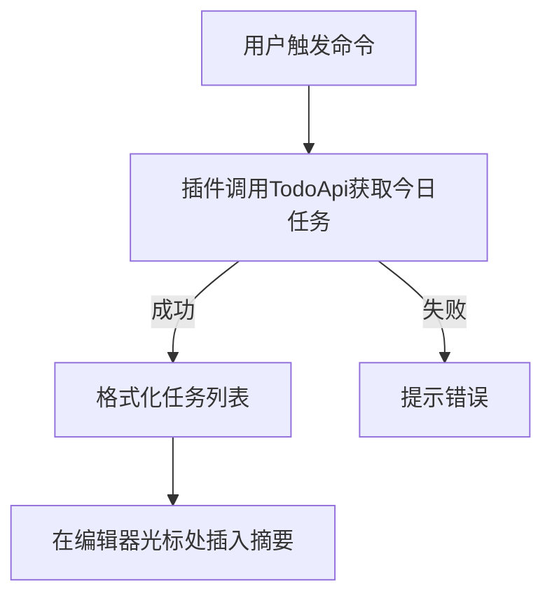

# Obsidian MS To-Do Sync 插件文档

本插件旨在将 Obsidian 与 Microsoft To-Do 进行集成，方便用户在 Obsidian 中管理和同步待办事项。

## 主要功能

-   **任务推送**: 将 Obsidian 中的文本快速创建为 Microsoft To-Do 任务。
-   **任务查看**: 直接从 Obsidian 跳转到 Microsoft To-Do 查看任务详情。
-   **任务摘要**: 在 Obsidian 笔记中插入 Microsoft To-Do 的今日任务列表。
-   **双向同步 (部分实现)**: 支持从远程获取任务详情，以及推送/拉取带详情的任务。
-   **灵活配置**: 用户可以配置 Microsoft API 的认证信息和同步的目标列表。

## 安装与配置

1.  **安装插件**: (标准 Obsidian 插件安装步骤)
2.  **配置插件**:
    *   打开插件设置面板。
    *   **Microsoft Authentication Client ID**: 输入您的 Azure 应用注册的客户端 ID。如果您不确定，可以留空，插件会尝试使用默认配置，但这可能不是最优或最安全的方式。建议注册您自己的 Azure AD 应用。
    *   **Microsoft Authentication Authority**: 输入您的 Azure 应用的授权机构 URL。通常类似于 `https://login.microsoftonline.com/YOUR_TENANT_ID`。留空则使用通用端点。
    *   **To-Do List for Sync**: 选择您希望同步到的 Microsoft To-Do 列表。
    *   ... (其他设置项说明)

## 使用方法

### 1. 推送任务到 Microsoft To-Do

#### 操作方式

-   **命令面板**:
    -   `MsTodoSync: Push selected text to Microsoft To-Do`: 仅创建任务，不修改原文。
    -   `MsTodoSync: Push selected text to Microsoft To-Do and replace`: 创建任务，并将原文替换为任务链接（或其他标记，具体行为取决于插件实现）。
-   **编辑器右键菜单**:
    -   `Microsoft To-Do` -> `Sync to To-Do and Replace`: 功能同上命令。

#### 流程图

### 2. 在 Microsoft To-Do 中打开任务

#### 操作方式

-   **命令面板**: `MsTodoSync: Open link to ToDo task`
-   **编辑器右键菜单**: `Microsoft To-Do` -> `Open To-Do Task`

#### 流程

1.  将光标置于包含 Microsoft To-Do 任务链接或特定任务标记的行。
2.  执行命令或点击菜单。
3.  插件会尝试解析任务信息并打开浏览器跳转到对应的 Microsoft To-Do 任务页面。

#### 流程图

### 3. 插入今日任务摘要

#### 操作方式

-   **命令面板**: `MsTodoSync: Insert a summary of today's tasks from Microsoft To-Do`

#### 流程

1.  在笔记中希望插入摘要的位置放置光标。
2.  执行命令。
3.  插件会从您配置的 Microsoft To-Do 列表中拉取标记为“今天”的任务，并将其摘要插入到光标位置。

#### 流程图

### 4. 其他功能 (编辑器菜单)

编辑器右键菜单的 `Microsoft To-Do` 子菜单中还包含：

-   **Fetch From Remote**: 获取当前笔记中链接的任务在 Microsoft To-Do 上的最新详情并更新本地笔记。
-   **Sync Task with details (Push)**: 将本地笔记中的任务及其子任务（如果格式支持）推送到 Microsoft To-Do，并更新远程任务的详情。
-   **Sync Task with details (Pull)**: 从 Microsoft To-Do 拉取任务及其子任务的详情，并更新本地笔记。

**(针对这些更复杂的功能，可以进一步绘制详细的流程图)**

## 开发者相关 (Hacking Menu)

如果插件设置中开启了 `hackingEnabled`，编辑器右键菜单会出现 `Microsoft To-Do - Hacking` 子菜单，提供一些开发者调试用的功能，例如：

-   Sync Vault
-   Update Task Cache
-   Reset Task Cache
-   Cleanup Local Task Lookup Table
-   Insert all tasks with body
-   Insert all tasks
-   Add Missing Tasks

**警告**: 这些功能主要用于开发和调试，普通用户请谨慎使用。

---

*文档最后更新时间: {{ CURRENT_DATE }}*