# Obsidian Microsoft To-Do 同步插件的缓存机制

本文档详细介绍了 Obsidian Microsoft To-Do 同步插件（obsidian-mstodo-sync）中任务缓存机制的实现和代码流程。该插件使用 `mstd-tasks-delta.json` 文件来缓存从 Microsoft To-Do API 获取的任务数据，通过增量同步（Delta Sync）机制提高性能并减少 API 调用次数。

## 目录

- [缓存机制概述](#缓存机制概述)
- [数据模型](#数据模型)
- [缓存文件管理](#缓存文件管理)
- [增量同步流程](#增量同步流程)
- [缓存合并策略](#缓存合并策略)
- [核心代码流程图](#核心代码流程图)
- [常见问题排查](#常见问题排查)

## 缓存机制概述

插件的缓存机制主要解决以下问题：

1. **减少 API 调用**：通过本地存储任务数据，减少对 Microsoft Graph API 的请求次数
2. **离线访问**：当用户离线时，仍能查看和操作之前同步的任务
3. **增量更新**：使用 Microsoft Graph API 的 delta 功能，只获取上次同步后发生变化的任务
4. **多列表支持**：同时缓存和管理多个 To-Do 列表的任务数据

缓存机制的核心是 `mstd-tasks-delta.json` 文件，它存储了所有任务列表及其任务的完整数据，以及用于增量同步的 `deltaLink`。

## 数据模型

缓存使用两个主要的数据模型：

1. **TasksDeltaCollection**：包含单个列表的任务和增量同步状态
   ```typescript
   export class TasksDeltaCollection {
       constructor(
           public allTasks: TodoTask[],     // 列表中的所有任务
           public deltaLink: string,        // 增量同步链接
           public listId: string,           // 列表ID
           public name: string,             // 列表名称
       ) {}
   }
   ```

2. **ListsDeltaCollection**：包含所有列表的集合
   ```typescript
   export class ListsDeltaCollection {
       constructor(
           public allLists: TasksDeltaCollection[] // 所有列表的集合
       ) {}
   }
   ```

## 缓存文件管理

缓存文件的路径位于 Obsidian 插件目录下：

```typescript
const pluginId = this.plugin.manifest.id;
this.deltaCachePath = `${this.plugin.app.vault.configDir}/plugins/${pluginId}/mstd-tasks-delta.json`;
```

缓存文件管理涉及以下操作：

### 1. 读取缓存

```typescript
private async getDeltaCache(): Promise<ListsDeltaCollection | undefined> {
    const adapter: DataAdapter = this.plugin.app.vault.adapter;
    let cachedTasksDelta: ListsDeltaCollection | undefined;

    if (await adapter.exists(this.deltaCachePath)) {
        cachedTasksDelta = JSON.parse(await adapter.read(this.deltaCachePath)) as ListsDeltaCollection;
    }

    return cachedTasksDelta;
}
```

### 2. 写入缓存

```typescript
private async setDeltaCache(cachedTasksDelta: ListsDeltaCollection) {
    const adapter: DataAdapter = this.plugin.app.vault.adapter;
    await adapter.write(this.deltaCachePath, JSON.stringify(cachedTasksDelta));
}
```

### 3. 重置缓存

```typescript
private async resetDeltaCache() {
    const adapter: DataAdapter = this.plugin.app.vault.adapter;
    if (await adapter.exists(this.deltaCachePath)) {
        await adapter.remove(this.deltaCachePath);
    }
}
```

## 增量同步流程

增量同步（Delta Sync）是缓存机制的核心，这种方式允许插件只获取自上次同步以来发生变化的任务，大大减少数据传输和 API 调用次数。

### 任务增量同步过程：

1. **读取本地缓存**：从 `mstd-tasks-delta.json` 文件读取上次同步的状态和 deltaLink
2. **调用 Microsoft API**：使用 deltaLink 请求自上次同步以来变化的任务
3. **合并数据**：将本地缓存与从 API 获取的数据合并
4. **更新 deltaLink**：保存 API 返回的新 deltaLink 以用于下次同步
5. **保存缓存**：将合并后的数据写入缓存文件

## 缓存合并策略

当从 API 获取增量更新时，需要将新数据与现有缓存合并。合并策略如下：

```typescript
private mergeCollections(col1: TodoTask[], col2: TodoTask[]): TodoTask[] {
    const map = new Map<string, TodoTask>();

    // 添加项目到映射的辅助函数
    function addToMap(item: TodoTask) {
        if (item.id && item.lastModifiedDateTime) {
            const existingItem = map.get(item.id);
            // 如果没有上次修改时间，则使用当前项目
            if (
                !existingItem ||
                new Date(item.lastModifiedDateTime) > new Date(existingItem.lastModifiedDateTime ?? 0)
            ) {
                map.set(item.id, item);
            }
        }
    }

    // 将两个集合中的项目添加到映射
    for (const item of col1) {
        addToMap(item);
    }

    for (const item of col2) {
        addToMap(item);
    }

    // 将映射值转换回数组
    return Array.from(map.values());
}
```

这种合并策略确保：
1. 每个任务只保留一个最新版本
2. 以最后修改时间决定哪个版本更新
3. 删除的任务不会保留在缓存中

## 核心代码流程图

### 缓存初始化流程

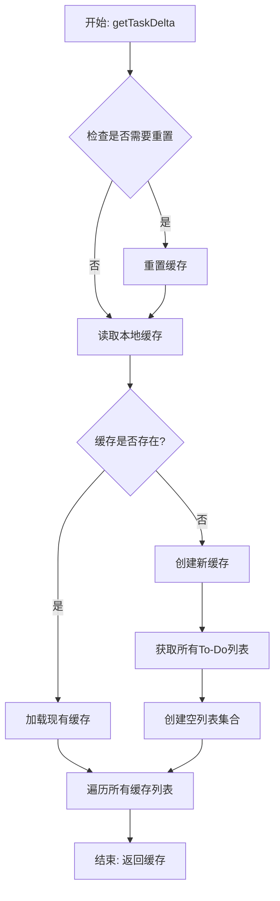

### 任务增量同步流程

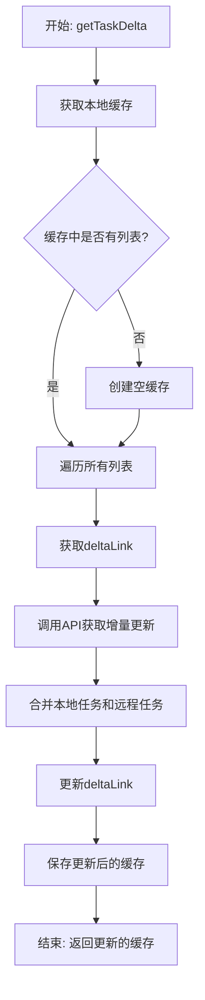

### msToDoActions.ts 和 msTodoCommand.ts 中的缓存使用

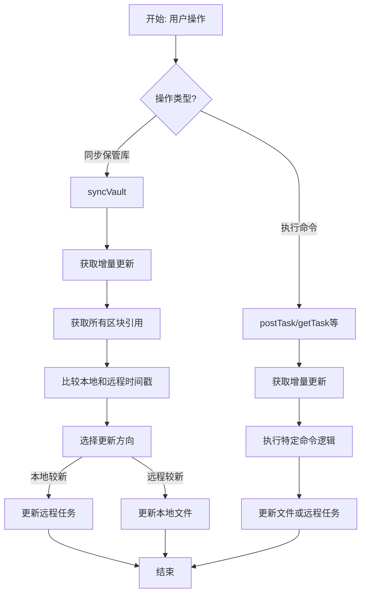

## 常见问题排查

问题排查时，可以检查以下几个方面：

1. **缓存文件路径**：确保 `mstd-tasks-delta.json` 存在于正确位置
   ```
   <vault>/.obsidian/plugins/obsidian-mstodo-sync/mstd-tasks-delta.json
   ```

2. **缓存格式**：确保缓存文件包含正确的数据结构（ListsDeltaCollection）

3. **列表ID匹配**：确保列表名称和列表ID正确匹配，避免重复创建列表

4. **任务ID查询**：检查任务ID查找逻辑，确保正确使用缓存中的任务

5. **增量同步问题**：如果增量同步出现问题，可以尝试重置缓存并重新同步

6. **日志信息**：检查插件的日志输出，了解缓存操作和 API 调用的详细信息 

# Microsoft To-Do 同步插件的缓存与 API 交互流程

本文档详细说明了 Obsidian Microsoft To-Do 同步插件中缓存与 Microsoft Graph API 的交互流程。这个交互过程是插件核心功能的基础，确保了任务数据在 Obsidian 和 Microsoft To-Do 之间的高效同步。

## 目录

- [概述](#概述)
- [API 接口层](#api-接口层)
- [缓存层](#缓存层)
- [交互流程](#交互流程)
- [核心功能实现](#核心功能实现)
- [错误处理](#错误处理)
- [性能优化](#性能优化)

## 概述

缓存与 API 交互流程涉及多个核心组件：

1. **TodoApi 类**：负责与 Microsoft Graph API 直接通信
2. **缓存机制**：使用 `mstd-tasks-delta.json` 存储任务数据
3. **MsTodoActions 类**：协调 API 调用和缓存操作
4. **MsTodoCommand 功能**：实现用户可直接触发的命令

这些组件协同工作，确保数据在本地和远程之间高效同步，并提供良好的用户体验。

## API 接口层

`TodoApi` 类封装了所有与 Microsoft Graph API 的直接交互，主要包括以下功能：

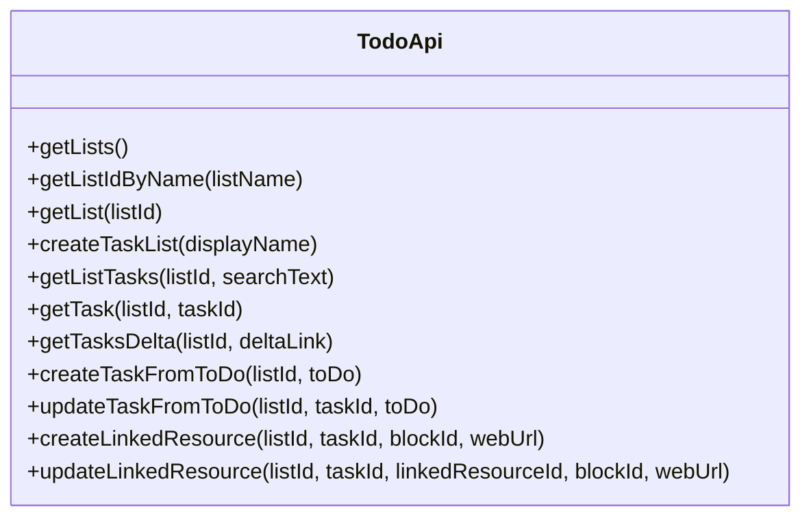

### 重要方法详解

- **getTasksDelta**：实现增量同步功能，只获取变化的任务
  ```typescript
  async getTasksDelta(listId: string, deltaLink: string): Promise<TasksDeltaCollection> {
      // 参数验证
      if (!listId || typeof listId !== 'string') {
          this.logger.error(`getTasksDelta: Invalid listId parameter: ${listId}`);
          throw new Error(`Invalid list ID: ${listId}`);
      }

      // 构建正确的端点
      let endpoint: string;
      if (deltaLink === '') {
          endpoint = `/me/todo/lists/${listId}/tasks/delta`;
      } else {
          endpoint = deltaLink;
      }

      const allTasks: TodoTask[] = [];
      let response = await this.client.api(endpoint).get();
      
      // 处理分页和结果
      // ...
      
      return new TasksDeltaCollection(allTasks, deltaLink, listId, '');
  }
  ```

## 缓存层

缓存层负责管理本地任务数据，减少 API 调用并提供离线访问能力：

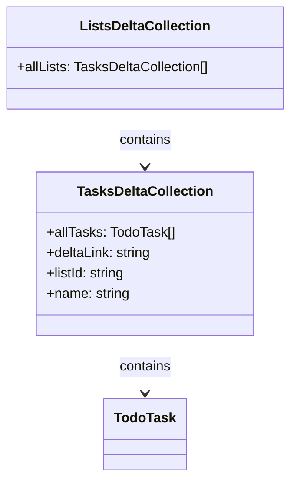

## 交互流程

### 初始化过程

当用户首次使用插件或手动重置缓存时，执行以下流程：

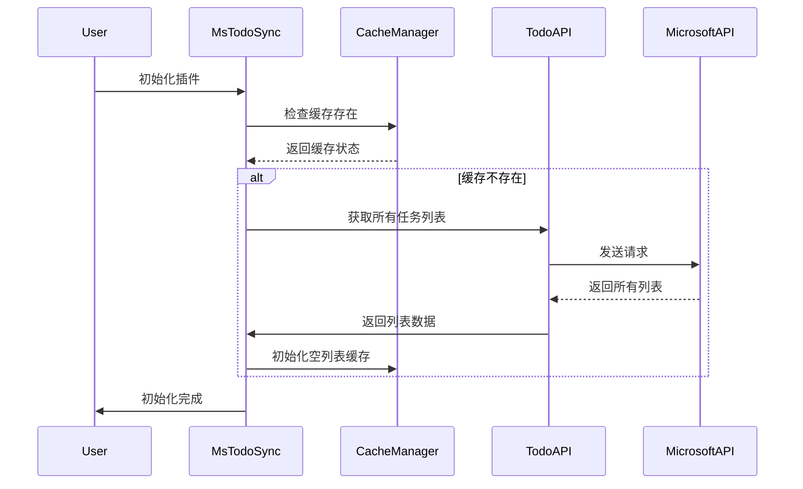

### 任务同步流程

当用户触发同步操作时：

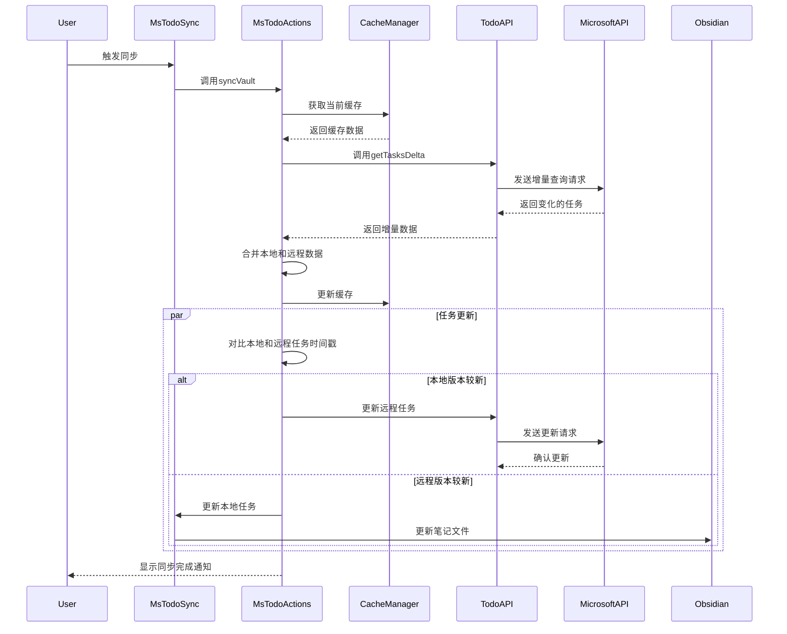

## 核心功能实现

### 1. 创建新任务

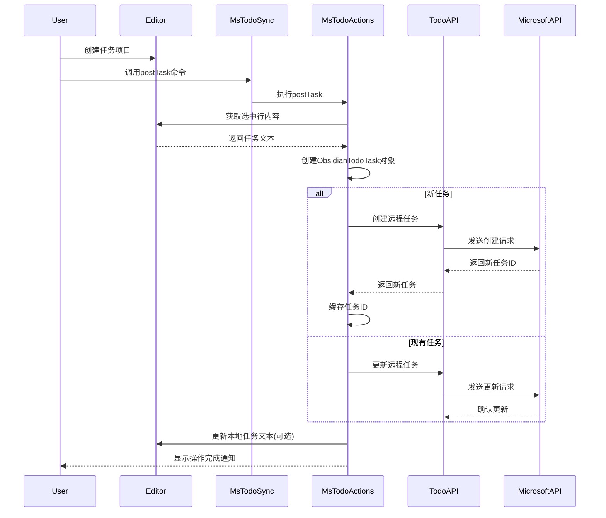

### 2. 获取远程任务更新

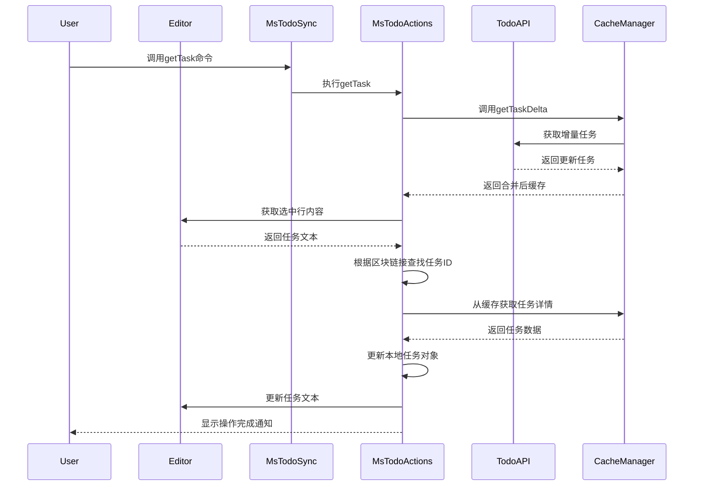

## 错误处理

插件在 API 交互过程中实现了稳健的错误处理机制：

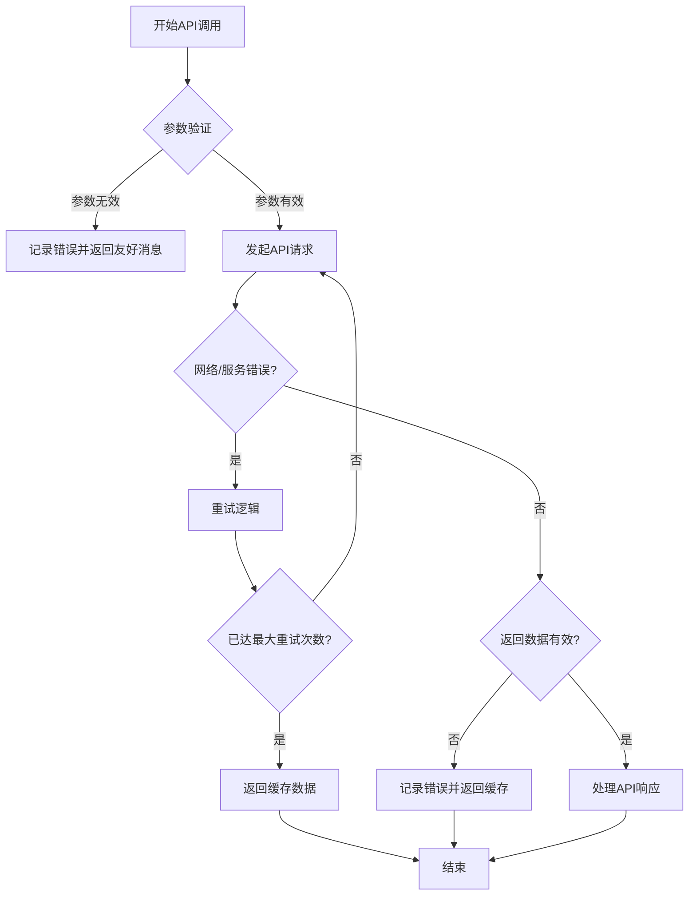

### 关键错误处理点

1. **API 请求前验证**：确保所有必需参数有效
2. **网络错误处理**：在网络不稳定时使用重试逻辑
3. **返回数据验证**：确保 API 返回数据结构符合预期
4. **缓存作为备份**：在 API 调用失败时使用本地缓存数据
5. **详细日志记录**：记录错误详情以便于调试

## 性能优化

插件采用了多种策略优化 API 交互性能：

1. **增量同步**：使用 Microsoft Graph API 的 delta 功能，只获取变更数据
2. **智能缓存**：缓存所有任务和列表数据，减少 API 调用
3. **合并策略**：根据最后修改时间智能合并本地和远程数据
4. **按需加载**：只在必要时加载完整任务详情
5. **批量处理**：合并多个操作为单次 API 调用

### 增量同步性能提升

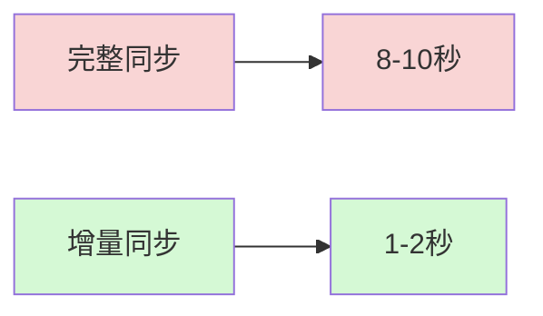

增量同步大幅减少了数据传输量和处理时间，特别是在任务数量较多的情况下效果更为显著。 

# Microsoft To-Do 同步插件关键代码实现详解

本文档详细分析 Obsidian Microsoft To-Do 同步插件的三个核心代码文件：`msToDoActions.ts`、`msTodoCommand.ts` 和 `todoApi.ts`，解释它们的功能、实现方式和相互关系。

## 目录

- [代码文件概述](#代码文件概述)
- [msToDoActions.ts](#mstodoactionsts)
- [msTodoCommand.ts](#mstodocommandts)
- [todoApi.ts](#todoapits)
- [类关系图](#类关系图)
- [关键代码实现解析](#关键代码实现解析)
- [最佳实践总结](#最佳实践总结)

## 代码文件概述

插件的核心逻辑分布在三个主要的 TypeScript 文件中：

1. **msToDoActions.ts** - 包含主要的业务逻辑和用户操作处理
2. **msTodoCommand.ts** - 处理命令的执行和用户交互
3. **todoApi.ts** - 封装与 Microsoft Graph API 的所有交互

这三个文件形成了层次分明的架构，确保了代码的可维护性和可扩展性。

## msToDoActions.ts

`msToDoActions.ts` 是插件的核心类，负责处理各种用户操作并协调缓存与 API 交互。

### 主要功能

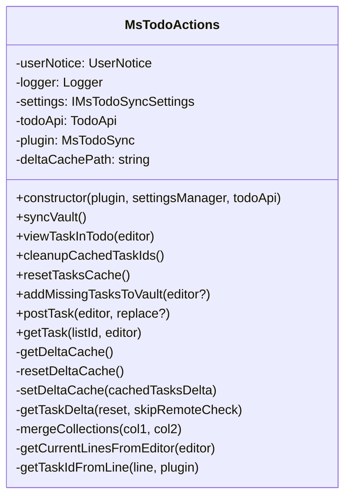

### 关键方法解析

#### 构造函数

```typescript
constructor(
    plugin: MsTodoSync,
    private settingsManager: SettingsManager,
    todoApi: TodoApi,
) {
    this.settings = settingsManager.settings;
    this.plugin = plugin;
    this.todoApi = todoApi;
    
    // 修改缓存路径使用 pluginId 而不是 dir，避免路径问题
    const pluginId = this.plugin.manifest.id;
    // 确保使用统一的缓存位置 - 使用 configDir 而非 dir
    this.deltaCachePath = `${this.plugin.app.vault.configDir}/plugins/${pluginId}/mstd-tasks-delta.json`;
    
    this.logger.info(`Initialized MsTodoActions with delta cache path: ${this.deltaCachePath}`);
}
```

构造函数负责初始化类，并设置缓存文件路径。这里特别注意使用 `pluginId` 而不是 `dir`，以避免路径问题。

#### syncVault

```typescript
public async syncVault() {
    this.userNotice.showMessage(t('CommandNotice_SyncingVault'), 3000);
    // 获取所有区块
    const blockCache = this.getAllVaultBlocks();
    // ...
    
    // 获取所有任务从缓存
    const cachedTasksDelta = await this.getTaskDelta();
    
    // ...
    
    // 比较和更新任务
    for (const blockId in this.plugin.settings.taskIdLookup) {
        // ...
        const localTaskNewer = new Date(cachedTask.lastModifiedDateTime) < new Date(localTask.mtime);
        
        if (localTaskNewer) {
            // 本地更新到远程
            // ...
        } else {
            // 远程更新到本地
            // ...
        }
    }
    
    this.userNotice.showMessage(t('CommandNotice_SyncComplete'), 3000);
}
```

`syncVault` 是核心同步方法，负责在 Obsidian 保管库和 Microsoft To-Do 之间同步任务。它通过比较时间戳来决定是更新本地任务还是远程任务。

#### getTaskDelta

```typescript
private async getTaskDelta(
    reset: boolean = false,
    skipRemoteCheck: boolean = false,
): Promise<ListsDeltaCollection | undefined> {
    if (reset) {
        this.logger.info('Resetting Delta Cache');
        await this.resetDeltaCache();
    }
    
    // ...
    
    let cachedTasksDelta = await this.getDeltaCache();
    
    if (!cachedTasksDelta) {
        this.logger.info('Cache not found, creating new cache');
        cachedTasksDelta = new ListsDeltaCollection([]);
        
        const allToDoLists = await this.todoApi.getLists();
        // ...
    }
    
    // 遍历每个列表获取增量更新
    for (const list of cachedTasksDelta.allLists) {
        const deltaLink = list.deltaLink == '' ? '' : list.deltaLink;
        
        let returnedTask = new TasksDeltaCollection([], '', list.listId, list.name);
        if (!skipRemoteCheck) {
            returnedTask = await this.todoApi.getTasksDelta(list.listId, deltaLink);
        }
        
        // 合并任务
        // ...
    }
    
    // 保存更新的缓存
    await this.setDeltaCache(cachedTasksDelta);
    
    return cachedTasksDelta;
}
```

`getTaskDelta` 是缓存管理的核心方法，负责获取和合并任务增量更新。

## msTodoCommand.ts

`msTodoCommand.ts` 包含命令处理函数，将用户命令转换为具体操作。

### 主要功能

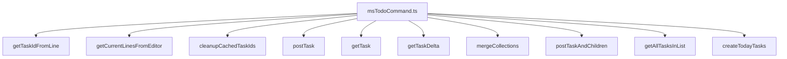

### 关键函数解析

#### getTask

```typescript
export async function getTask(
    todoApi: TodoApi,
    listId: string | undefined,
    editor: Editor,
    fileName: string | undefined,
    plugin: MsTodoSync,
) {
    // 如果没有 listId 但有 listName，则尝试查找并设置 listId
    if (!listId && plugin.settings.todoListSync?.listName) {
        listId = await todoApi.getListIdByName(plugin.settings.todoListSync.listName);
        
        // 更新设置
        if (listId) {
            plugin.settings.todoListSync.listId = listId;
            await plugin.saveSettings();
        }
    }
    
    // ...
    
    try {
        // 更新任务缓存
        try {
            await getTaskDelta(todoApi, listId, plugin, false);
        } catch (error) {
            logger.error('Error updating task delta:', error);
        }
        
        // 处理选中的行
        // ...
        
        // 如果有区块链接和任务ID，尝试直接从API获取最新任务状态
        if (todo.hasBlockLink && todo.hasId) {
            try {
                // 直接从API获取最新任务状态
                const remoteTask = await todoApi.getTask(listId, todo.id);
                
                if (remoteTask) {
                    todo.updateFromTodoTask(remoteTask);
                    return todo.getMarkdownTask(true);
                } else {
                    // 如果API未返回任务，尝试从缓存获取
                    return await tryGetFromCache(todo, plugin, logger);
                }
            } catch (error) {
                // 如果API查询失败，尝试从缓存获取
                return await tryGetFromCache(todo, plugin, logger);
            }
        }
        
        // ...
    } catch (error) {
        logger.error('Error in getTask:', error);
        userNotice.showMessage('处理任务时出错: ' + (error instanceof Error ? error.message : String(error)));
    }
}
```

`getTask` 函数负责从 Microsoft To-Do 获取任务并更新 Obsidian 中的任务状态。它首先尝试直接从 API 获取，如果失败则从缓存获取。

## todoApi.ts

`todoApi.ts` 封装了所有与 Microsoft Graph API 的直接交互，提供了干净的接口供其他组件使用。

### 主要类

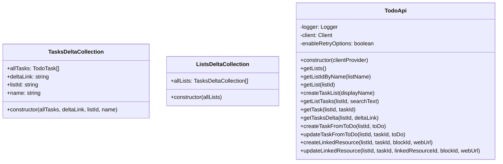

### 关键方法解析

#### getTasksDelta

```typescript
async getTasksDelta(listId: string, deltaLink: string): Promise<TasksDeltaCollection> {
    try {
        // 参数验证
        if (!listId || typeof listId !== 'string') {
            this.logger.error(`getTasksDelta: Invalid listId parameter: ${listId}`);
            throw new Error(`Invalid list ID: ${listId}`);
        }
        
        // 确保 deltaLink 是有效的字符串
        if (deltaLink && typeof deltaLink !== 'string') {
            this.logger.warn(`getTasksDelta: Invalid deltaLink format, using empty string instead`);
            deltaLink = '';
        }
        
        // 构建正确的端点
        let endpoint: string;
        if (deltaLink === '') {
            endpoint = `/me/todo/lists/${listId}/tasks/delta`;
        } else {
            endpoint = deltaLink;
        }
        
        const allTasks: TodoTask[] = [];
        
        // 发起API请求
        let response = await this.client
            .api(endpoint)
            .middlewareOptions([new RetryHandlerOptions(3, 3)])
            .get();
        
        // 处理分页结果
        while (response && response.value && response.value.length > 0) {
            for (const task of response.value) {
                if (task) allTasks.push(task);
            }
            
            // 处理分页
            if (response['@odata.nextLink']) {
                response = await this.client.api(response['@odata.nextLink']).get();
            } else {
                break;
            }
        }
        
        // 更新deltaLink
        if (response && response['@odata.deltaLink']) {
            deltaLink = response['@odata.deltaLink'];
        }
        
        return new TasksDeltaCollection(allTasks, deltaLink, listId, '');
    } catch (error) {
        this.logger.error(`getTasksDelta failed:`, error);
        // 返回空集合而不是抛出错误
        return new TasksDeltaCollection([], '', listId, '');
    }
}
```

`getTasksDelta` 方法是增量同步的核心，它使用 Microsoft Graph API 的 delta 查询功能，只获取自上次同步以来变化的任务。它还处理了分页结果和错误情况。

## 类关系图

以下是三个核心文件中类和函数的关系图：

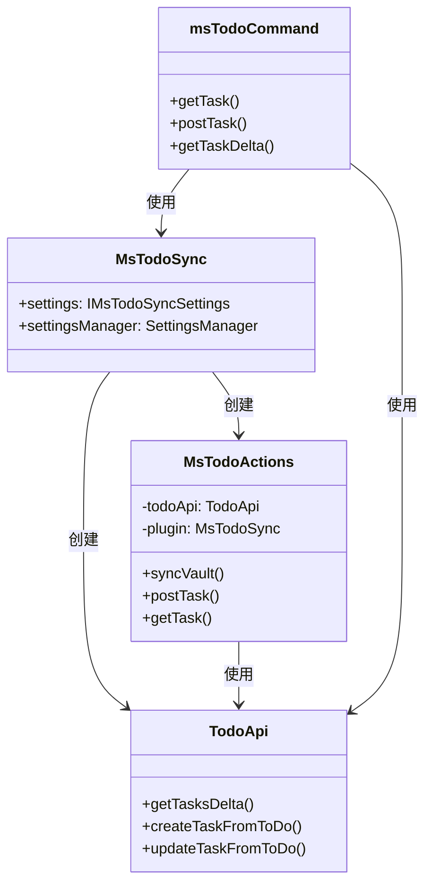

## 关键代码实现解析

### 1. 缓存路径统一

在代码开发过程中，发现了一个关键问题：不同地方的缓存路径不一致会导致缓存失效。最佳解决方案是使用统一的缓存路径：

```typescript
// msToDoActions.ts
const pluginId = this.plugin.manifest.id;
this.deltaCachePath = `${this.plugin.app.vault.configDir}/plugins/${pluginId}/mstd-tasks-delta.json`;

// msTodoCommand.ts
const pluginId = plugin.manifest.id;
const cachePath = `${plugin.app.vault.configDir}/plugins/${pluginId}/mstd-tasks-delta.json`;
```

### 2. 列表名称匹配逻辑改进

为解决列表重复创建问题，改进了列表名称匹配逻辑：

```typescript
// 改进列表名称匹配逻辑，使用不区分大小写的比较，并支持微软自动重命名的格式（如"列表名 (1)"）
const list = cachedTasksDelta.allLists.find((l) => 
    l.name.toLowerCase() === todo.listName?.toLowerCase() || 
    l.name.toLowerCase().startsWith(todo.listName?.toLowerCase() + ' (')
);
```

### 3. 创建列表后立即更新缓存

避免重复创建列表的另一个关键是在创建新列表后立即更新缓存：

```typescript
// 创建列表后立即更新本地缓存
if (newTaskList.id && newTaskList.displayName) {
    cachedTasksDelta.allLists.push(
        new TasksDeltaCollection([], '', newTaskList.id, newTaskList.displayName)
    );
    await this.setDeltaCache(cachedTasksDelta);
    this.logger.info(`Added new list to cache: ${newTaskList.displayName} (${newTaskList.id})`);
}
```

### 4. 健壮的错误处理

全面的错误处理确保插件在各种异常情况下仍能正常工作：

```typescript
// todoApi.ts 中的 getTasksDelta
try {
    // API 调用和处理
    // ...
} catch (error) {
    this.logger.error(`getTasksDelta failed:`, error);
    // 返回空集合而不是抛出错误
    return new TasksDeltaCollection([], '', listId, '');
}

// msTodoCommand.ts 中的 getTask
try {
    // 尝试从 API 获取任务
    const remoteTask = await todoApi.getTask(listId, todo.id);
    // ...
} catch (error) {
    logger.error(`Error getting task from API: ${error instanceof Error ? error.message : String(error)}`);
    // 如果 API 查询失败，尝试从缓存获取
    return await tryGetFromCache(todo, plugin, logger);
}
```

## 最佳实践总结

从这三个核心文件的实现中，可以总结出以下最佳实践：

1. **分层架构**：清晰的责任分离，API 层、业务逻辑层和命令处理层各司其职
2. **全面的错误处理**：在各个层次都添加了适当的错误处理，确保稳定性
3. **详细的日志记录**：关键操作都有日志记录，便于调试和问题排查
4. **增量同步优化**：只获取变化的数据，减少网络传输和处理时间
5. **缓存作为备份**：在 API 调用失败时使用缓存数据，提高可用性
6. **统一的缓存管理**：使用统一的缓存路径和格式，避免冲突
7. **智能合并策略**：根据时间戳合并本地和远程数据，解决冲突 