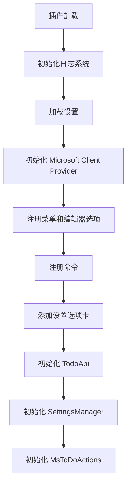
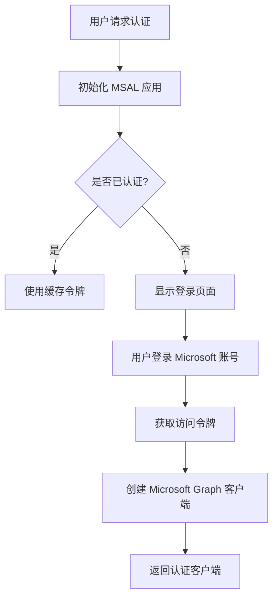
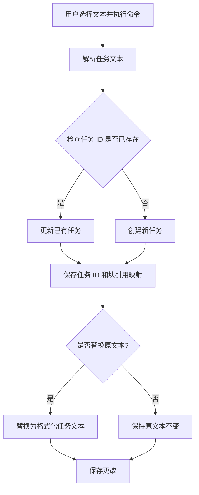
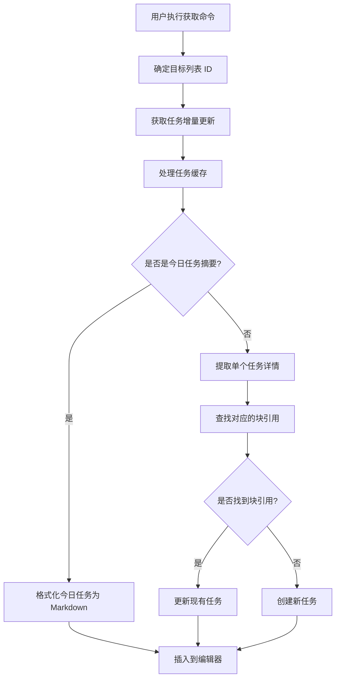
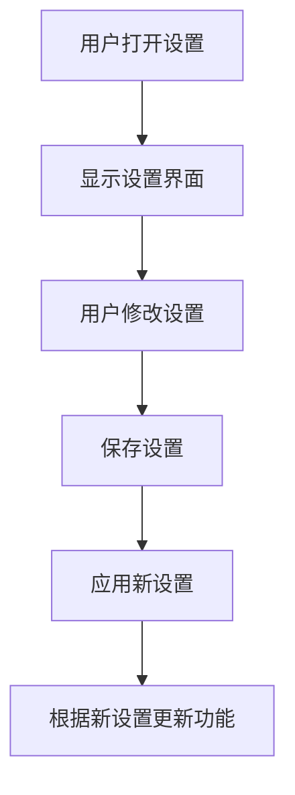
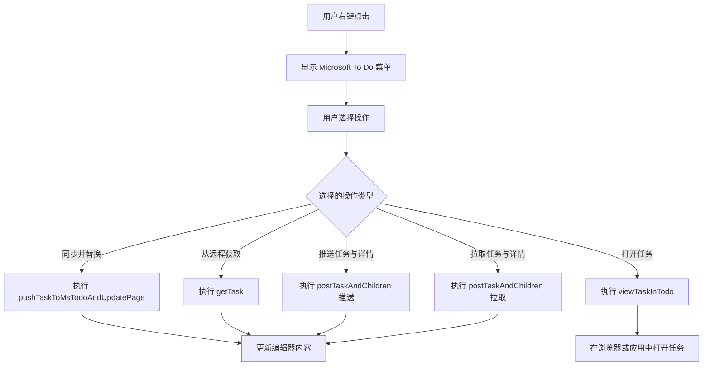

# Microsoft To Do Sync 功能流程图

## 插件初始化流程

```mermaid
flowchart TB
    A[插件加载] --> B[初始化日志系统]
    B --> C[加载设置]
    C --> D[初始化 Microsoft Client Provider]
    D --> E[注册菜单和编辑器选项]
    E --> F[注册命令]
    F --> G[添加设置选项卡]
    G --> H[初始化 TodoApi]
    H --> I[初始化 SettingsManager]
    I --> J[初始化 MsToDoActions]
```

## 认证流程

```mermaid
flowchart TB
    A[用户请求认证] --> B[初始化 MSAL 应用]
    B --> C{是否已认证?}
    C -->|是| D[使用缓存令牌]
    C -->|否| E[显示登录页面]
    E --> F[用户登录 Microsoft 账号]
    F --> G[获取访问令牌]
    G --> H[创建 Microsoft Graph 客户端]
    H --> I[返回认证客户端]
```

## 任务同步流程（Obsidian 到 Microsoft To Do）

```mermaid
flowchart TB
    A[用户选择文本并执行命令] --> B[解析任务文本]
    B --> C{检查任务 ID 是否已存在}
    C -->|是| D[更新已有任务]
    C -->|否| E[创建新任务]
    D --> F[保存任务 ID 和块引用映射]
    E --> F
    F --> G{是否替换原文本?}
    G -->|是| H[替换为格式化任务文本]
    G -->|否| I[保持原文本不变]
    H --> J[保存更改]
    I --> J
```

## 任务同步流程（Microsoft To Do 到 Obsidian）

```mermaid
flowchart TB
    A[用户执行获取命令] --> B[确定目标列表 ID]
    B --> C[获取任务增量更新]
    C --> D[处理任务缓存]
    D --> E{是否是今日任务摘要?}
    E -->|是| F[格式化今日任务为 Markdown]
    E -->|否| G[提取单个任务详情]
    F --> H[插入到编辑器]
    G --> I[查找对应的块引用]
    I --> J{是否找到块引用?}
    J -->|是| K[更新现有任务]
    J -->|否| L[创建新任务]
    K --> H
    L --> H
```

## 设置流程

```mermaid
flowchart TB
    A[用户打开设置] --> B[显示设置界面]
    B --> C[用户修改设置]
    C --> D[保存设置]
    D --> E[应用新设置]
    E --> F[根据新设置更新功能]
```

## 上下文菜单操作流程

```mermaid
flowchart TB
    A[用户右键点击] --> B[显示 Microsoft To Do 菜单]
    B --> C[用户选择操作]
    C --> D{选择的操作类型}
    D -->|同步并替换| E[执行 pushTaskToMsTodoAndUpdatePage]
    D -->|从远程获取| F[执行 getTask]
    D -->|推送任务与详情| G[执行 postTaskAndChildren 推送]
    D -->|拉取任务与详情| H[执行 postTaskAndChildren 拉取]
    D -->|打开任务| I[执行 viewTaskInTodo]
    E --> J[更新编辑器内容]
    F --> J
    G --> J
    H --> J
    I --> K[在浏览器或应用中打开任务]
``` 