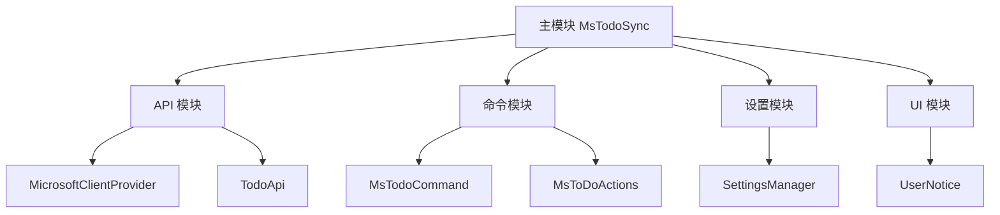
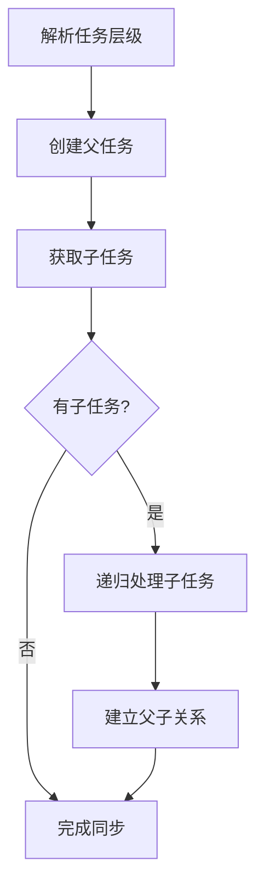

# Microsoft To Do Sync 技术实现详解

## 架构概述

Microsoft To Do Sync 插件基于模块化设计原则，主要通过以下几个核心模块协同工作：



## 核心模块详解

### 1. 认证与 API 集成模块

#### MicrosoftClientProvider

负责与 Microsoft 身份认证服务交互，使用 MSAL (Microsoft Authentication Library) 实现 OAuth 认证流程。

```typescript
class MicrosoftClientProvider {
    // 属性
    clientId: string;  // Microsoft 应用程序客户端 ID
    authority: string; // 认证服务地址
    
    // 方法
    createPublicClientApplication(): void;  // 创建 MSAL 客户端应用
    getClient(): Promise<Client>;  // 获取 Microsoft Graph 客户端
    getClientWithMiddleware(): Promise<Client>;  // 获取带中间件的客户端
}
```

#### TodoApi

封装了与 Microsoft Graph API 的所有任务相关操作，包括：

- 获取任务列表
- 创建/更新/删除任务
- 获取任务增量变更
- 任务链接资源管理

关键方法：
```typescript
class TodoApi {
    // 获取任务列表
    async getLists(): Promise<TodoTaskList[] | undefined>;
    
    // 通过名称获取列表 ID
    async getListIdByName(listName: string | undefined): Promise<string | undefined>;
    
    // 获取任务增量更新
    async getTasksDelta(listId: string, deltaLink: string): Promise<TasksDeltaCollection>;
    
    // 创建任务
    async createTaskFromToDo(listId: string | undefined, toDo: TodoTask): Promise<TodoTask>;
    
    // 更新任务
    async updateTaskFromToDo(listId: string | undefined, taskId: string, toDo: TodoTask): Promise<TodoTask>;
}
```

### 2. 命令控制模块

#### MsTodoCommand

实现了各种任务操作命令的核心逻辑：

- **postTask**: 将选中的文本作为任务发布到 Microsoft To Do
- **getTask**: 从 Microsoft To Do 获取任务
- **postTaskAndChildren**: 发送任务及其子任务
- **createTodayTasks**: 创建今日任务摘要

#### MsToDoActions

提供高级操作功能，如：

- 在 Microsoft To Do 中查看任务
- 同步整个保险库
- 管理任务缓存

### 3. 数据模型

#### ObsidianTodoTask

将 Obsidian 中的任务文本解析为结构化数据，处理格式化和状态映射。

关键功能：
- 解析任务文本中的状态、重要性和日期信息
- 转换为 Microsoft To Do 格式的任务
- 支持从 Microsoft To Do 任务转换为 Obsidian 格式

#### TasksDeltaCollection

管理从 Microsoft To Do 获取的任务增量更新，包括：
- 存储所有任务
- 管理增量链接 (deltaLink)
- 处理任务合并和去重

### 4. 设置管理

插件提供丰富的设置选项，支持用户自定义：

- Microsoft To Do 列表同步
- 显示格式（日期、时间、前缀等）
- 任务重要性和状态表示
- 日志级别

### 5. 用户界面和通知

提供友好的用户界面，包括：

- 用户通知（成功、错误信息）
- 上下文菜单集成
- 命令面板命令

## 关键流程技术实现

### Obsidian 任务同步到 Microsoft To Do

1. 解析选中的文本，从中提取任务信息
2. 检查任务是否有关联的 ID（通过块引用）
3. 如有 ID，则更新现有任务；否则创建新任务
4. 保存任务 ID 与块引用的映射关系
5. 根据设置决定是否替换原文本

关键代码片段：
```typescript
// 从编辑器获取当前行
const { lines } = await getCurrentLinesFromEditor(editor);

// 创建任务对象
const todo = new ObsidianTodoTask(plugin.settingsManager, line);

// 检查任务 ID
if (blockIdMatch) {
    // 更新已有任务
} else {
    // 创建新任务
}
```

### Microsoft To Do 任务同步到 Obsidian

1. 获取任务增量更新
2. 处理和合并任务缓存
3. 查找对应的块引用
4. 更新或创建对应的 Obsidian 任务

关键技术点：
- 使用增量同步减少 API 请求
- 块引用作为任务的唯一标识
- 缓存机制提高性能

## 高级功能

### 任务与子任务同步

插件支持任务层级结构的同步，通过递归处理任务树实现：



### 增量同步机制

使用 Microsoft Graph API 的增量查询功能，只获取变更的任务：

1. 第一次同步时获取全部任务
2. 后续同步只获取变更的任务
3. 使用 deltaLink 跟踪变更状态
4. 合并本地缓存和远程变更 