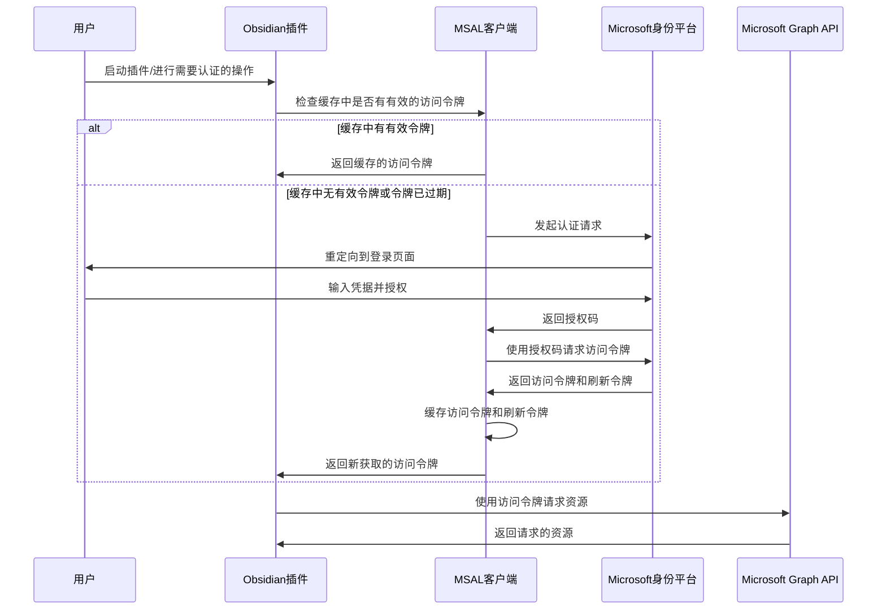

# Microsoft To Do Sync 认证与 API 集成模块

## 模块概述

认证与 API 集成模块是 Microsoft To Do Sync 插件的核心组件，负责处理与 Microsoft 服务的身份验证以及 API 通信。该模块分为两个主要部分：

1. **MicrosoftClientProvider**：负责身份认证流程，获取并维护访问令牌
2. **TodoApi**：封装与 Microsoft Graph API 的交互操作，处理任务相关的所有 API 请求

## 详细认证流程

### OAuth 2.0 认证机制

Microsoft To Do Sync 使用 OAuth 2.0 授权框架进行身份验证，具体实现基于 Microsoft Authentication Library (MSAL) 技术。认证流程如下：



### MicrosoftClientProvider 实现细节

`MicrosoftClientProvider` 类是认证流程的核心实现，主要功能包括：

1. 初始化 MSAL 应用实例
2. 管理身份验证流程
3. 处理令牌获取和续期
4. 创建已认证的 Microsoft Graph 客户端

关键代码实现：

```typescript
export class MicrosoftClientProvider {
    private app: msal.PublicClientApplication | undefined;
    private accessToken: string | undefined;
    public clientId: string = '默认客户端ID';
    public authority: string = '默认认证机构URL';
    
    // 创建 MSAL 客户端应用
    public createPublicClientApplication(): void {
        const msalConfig = {
            auth: {
                clientId: this.clientId,
                authority: this.authority,
                redirectUri: 'redirectURI'
            },
            cache: {
                cacheLocation: 'localStorage', // 或 'sessionStorage'
                storeAuthStateInCookie: true
            }
        };
        
        this.app = new msal.PublicClientApplication(msalConfig);
    }
    
    // 获取 Microsoft Graph 客户端
    public async getClient(): Promise<Client> {
        if (!this.app) {
            throw new Error('MSAL应用未初始化');
        }
        
        // 获取访问令牌
        this.accessToken = await this.getAccessToken();
        
        // 使用访问令牌创建已认证的 Graph 客户端
        return Client.init({
            authProvider: (done) => {
                done(null, this.accessToken);
            }
        });
    }
    
    // 获取带中间件(如重试逻辑)的客户端
    public async getClientWithMiddleware(): Promise<Client> {
        // 类似 getClient，但添加中间件配置
    }
    
    // 获取访问令牌
    private async getAccessToken(): Promise<string> {
        // 尝试从缓存获取令牌
        // 如果失败或令牌过期，触发新的认证流程
    }
}
```

## 认证信息的持久化

### 令牌缓存机制

Microsoft To Do Sync 插件的认证信息持久化主要依赖 MSAL 库提供的令牌缓存机制，主要特点：

1. **默认缓存位置**：MSAL 默认使用浏览器的 `localStorage` 或 `sessionStorage` 存储令牌
2. **适应 Obsidian 环境**：插件改写了默认缓存实现，使用 Obsidian 的数据存储系统

### 持久化的认证信息内容

插件持久化存储的认证信息包括：

1. **访问令牌 (Access Token)**：
   - 用于访问 Microsoft Graph API
   - 短期有效（通常为 1 小时）
   - 包含用户的身份信息和授权范围

2. **刷新令牌 (Refresh Token)**：
   - 用于无需用户交互获取新的访问令牌
   - 长期有效（通常为 90 天）
   - 存储更安全，不包含用户身份信息

3. **ID 令牌 (ID Token)**：
   - 包含用户的身份信息
   - 由 OpenID Connect 协议提供
   - 用于验证用户身份

### 自定义令牌缓存实现

插件实现了自定义的令牌缓存管理，将认证信息存储在 Obsidian 的配置中：

```typescript
// 自定义令牌缓存实现示例
class ObsidianTokenCache implements msal.ICachePlugin {
    private readonly plugin: MsTodoSync;
    
    constructor(plugin: MsTodoSync) {
        this.plugin = plugin;
    }
    
    // 从 Obsidian 数据存储中加载令牌缓存
    async beforeCacheAccess(cacheContext: msal.ICacheContext): Promise<void> {
        // 从 Obsidian 数据中读取缓存数据
        const tokenCache = this.plugin.settings.tokenCache || '{}';
        cacheContext.tokenCache.deserialize(tokenCache);
    }
    
    // 将更新后的令牌缓存保存到 Obsidian 数据存储
    async afterCacheAccess(cacheContext: msal.ICacheContext): Promise<void> {
        if (cacheContext.cacheHasChanged) {
            // 序列化并保存到 Obsidian 设置
            this.plugin.settings.tokenCache = cacheContext.tokenCache.serialize();
            await this.plugin.saveSettings();
        }
    }
}
```

### 安全考虑

认证信息的持久化存储涉及以下安全考虑：

1. **敏感信息加密**：访问令牌和刷新令牌等敏感信息应加密存储
2. **令牌作用域限制**：请求的令牌仅包含必要的权限范围
3. **令牌自动失效**：访问令牌有较短的生命周期，自动失效
4. **用户可撤销授权**：用户可以随时从 Microsoft 账户安全设置中撤销应用的访问权限

## TodoApi 与 Graph API 交互

`TodoApi` 类负责使用已认证的 Graph 客户端与 Microsoft To Do API 交互：

1. 封装 Graph API 端点调用
2. 处理 API 响应和错误
3. 提供任务操作的高级方法

示例方法：

```typescript
export class TodoApi {
    private client: Client;
    
    constructor(clientProvider: MicrosoftClientProvider) {
        // 获取已认证的客户端
        clientProvider.getClient()
            .then(client => {
                this.client = client;
            })
            .catch(() => {
                throw new Error('无法获取认证客户端');
            });
    }
    
    // 获取任务列表
    async getLists(): Promise<TodoTaskList[] | undefined> {
        const endpoint = '/me/todo/lists';
        const todoLists = (await this.client.api(endpoint).get()).value as TodoTaskList[];
        return todoLists;
    }
    
    // 使用增量查询获取任务更新
    async getTasksDelta(listId: string, deltaLink: string): Promise<TasksDeltaCollection> {
        // 使用认证客户端访问 Graph API
        const endpoint = deltaLink || `/me/todo/lists/${listId}/tasks/delta`;
        // 处理 API 响应...
    }
}
```

## 总结

认证与 API 集成模块是整个插件的基础，通过 Microsoft Identity Platform 和 OAuth 2.0 协议实现安全的身份验证，并使用 MSAL 库管理令牌生命周期。认证信息的持久化通过自定义缓存实现，确保用户无需频繁登录，同时保证数据安全性。该模块为插件的所有功能提供了安全、可靠的 API 访问能力。 